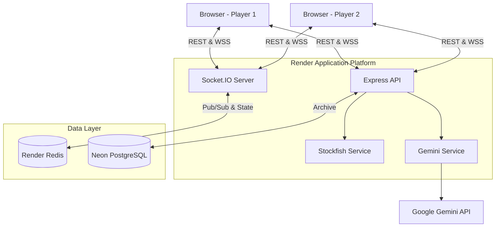
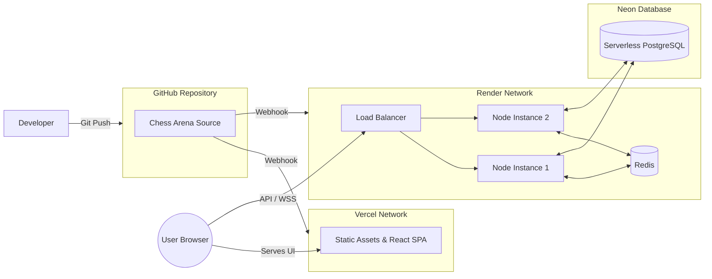

# Chess Arena Architecture

This document describes the high-level architecture, deployment topology, and core data flows of the Chess Arena platform.

---

## 1. High-Level Architecture

Chess Arena follows a modern, decoupled monolithic approach. The frontend is a static Single Page Application (SPA), while the backend is a stateless Node.js process that delegates state to external persistence layers.

### Component Diagram

---

## 2. Core Subsystems

### Frontend

- **Framework:** React 18 / Vite
- **Responsibility:** Rendering the chessboard (`react-chessboard`), validating optimistic UI interactions, managing the WebSocket connection, and displaying AI coaching.
- **State Management:** React Context API for global state (Theme, Socket, Game) and local state for UI transitions.

### Backend

- **Framework:** Express.js 5 / Socket.IO
- **Responsibility:** Serving REST endpoints, maintaining WebSocket rooms, and enforcing game rules using `chess.js` (Server-Authoritative model).
- **Statelessness:** The backend processes maintain no long-term state. All game state is injected from and persisted to Redis.

### Redis

- **Responsibility:** High-speed, ephemeral storage for active gameplay state. Acts as the Pub/Sub adapter for Socket.IO, enabling horizontal scaling of backend nodes.

### PostgreSQL

- **Responsibility:** Long-term archival storage for completed games, moves, player identities, and saved analyses. Interacted with via Drizzle ORM.

### Stockfish

- **Implementation:** WebAssembly port (`stockfish.js`) running in an isolated Node.js worker thread.
- **Responsibility:** Providing raw, objective, deterministic evaluations (centipawns, depth, best moves) for game histories.
- **Resilience:** Implements automatic crash recovery and timeouts.

### Gemini

- **Responsibility:** Translating raw Stockfish metrics into human-readable coaching tips (Beginner, Intermediate, Advanced).
- **Resilience:** Implements exponential backoff for rate limits and degrades gracefully if the API is unreachable.

---

## 3. Data Flows

### Request Flow (HTTP)

Standard stateless request cycle, primarily used for history, health checks, and analysis.

1. Client makes HTTP GET/POST to `/api/*`.
2. Request hits Render load balancer and is routed to an Express instance.
3. Express processes middleware (Helmet, Rate Limiter, CORS).
4. Controller queries PostgreSQL via Drizzle.
5. Response returned to client.

### Socket Flow (Gameplay)

1. Client connects to `/` via WebSocket.
2. Client emits `join_game` with a UUID.
3. Express handles the event, querying Redis for the active game state.
4. If valid, the player is added to the Socket.IO room.
5. Client emits `make_move`.
6. Express validates the move using `chess.js`.
7. Express updates Redis and broadcasts the new state to the room.

### History Flow

1. When a game ends (checkmate, resignation, draw), the backend transitions the game state.
2. The final state is removed from Redis.
3. The game, players, and full move list are asynchronously inserted into PostgreSQL.

### Review / Analysis Pipeline

1. Client requests a review for a completed game (`/api/history/:gameId/review`).
2. Backend checks if an analysis already exists in PostgreSQL.
3. If not, backend queries PostgreSQL for the PGN.
4. Backend sends the final position (FEN) to the Stockfish service.
5. Stockfish returns the evaluation.
6. Backend sends the PGN, FEN, and Stockfish evaluation to the Gemini service.
7. Gemini returns a structured coaching object.
8. Backend saves the analysis to PostgreSQL and returns it to the client.

---

## 4. Deployment Topology

### Constraints & Considerations

- Because we use WebSockets, standard serverless functions (like AWS Lambda or Vercel Functions) cannot host the backend. The backend must be a long-running web service (e.g., Render Web Service).
- Render's load balancer distributes traffic. Because we use `redis` as the Socket.IO adapter, clients can connect to any Node instance and still receive broadcasts from clients connected to other instances.
