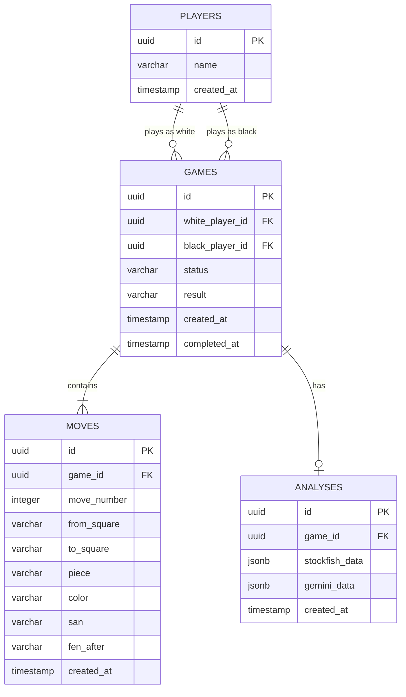

# Database Architecture

Chess Arena uses a relational database model implemented in PostgreSQL, managed through Drizzle ORM.

The database is exclusively used for **archiving completed games**. Active games reside in Redis to eliminate write contention and latency during real-time gameplay.

---

## 1. Entity Relationship (ER) Diagram

---

## 2. Table Descriptions

### `players`
Stores ephemeral user profiles. Since authentication is not implemented, players are uniquely identified by a UUID generated on the client and stored in `localStorage`.
- **Indexes:** Primary Key on `id`.

### `games`
Archives completed games.
- `status`: Always represents a terminal state in the DB (e.g., `completed`, `resigned`, `drawn`).
- `result`: Indicates the winner (`w`, `b`, or `draw`).
- **Indexes:** Primary Key on `id`. Foreign keys to `players(id)`.

### `moves`
A complete chronological ledger of every move made in a game.
- `san`: Standard Algebraic Notation (e.g., `Nxf3+`).
- `fen_after`: The board state *after* the move was applied.
- **Indexes:** 
  - Primary Key on `id`.
  - Composite Index on `(game_id, move_number)` for fast chronological retrieval of a game's move history.

### `analyses`
Stores expensive, lazily-generated post-game reviews.
- `stockfish_data`: JSON blob containing engine evaluation, depth, and best move.
- `gemini_data`: JSON blob containing AI coaching tips and summaries.
- **Indexes:** Primary Key on `id`. Unique Foreign Key on `game_id` (1:1 relationship).

---

## 3. Migration Strategy

Schema changes are managed using Drizzle Kit.
1. Modify the schema definitions in `backend/src/db/schema.js`.
2. Generate a migration file: `npm run db:generate`.
3. Apply the migration to the database: `npm run db:migrate`.

In production, migrations should be applied during the CI/CD deployment phase before the new application instances begin serving traffic.

---

## 4. Persistence Flow

1. **Gameplay:** Two players interact. Moves are validated and stored in Redis.
2. **Termination:** A player is checkmated or resigns.
3. **Archival:** The backend `ChessService` fires an asynchronous event.
4. **Transaction:** The `game-repository` reads the final state from Redis, constructs the DB objects, and inserts the `games` and `moves` rows into PostgreSQL within a single database transaction.
5. **Cleanup:** The active game is deleted from Redis.
