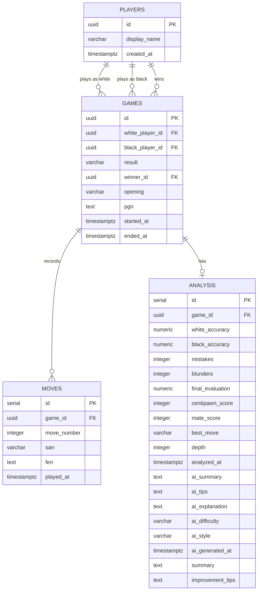

# ER Diagram

```mermaid
erDiagram
  PLAYERS ||--o{ GAMES : "plays as white"
  PLAYERS ||--o{ GAMES : "plays as black"
  PLAYERS ||--o{ GAMES : "wins"
  GAMES ||--o{ MOVES : "records"
  GAMES ||--o| ANALYSIS : "has"

  PLAYERS {
    uuid id PK
    varchar display_name
    timestamptz created_at
  }

  GAMES {
    uuid id PK
    uuid white_player_id FK
    uuid black_player_id FK
    varchar result
    uuid winner_id FK
    varchar opening
    text pgn
    timestamptz started_at
    timestamptz ended_at
  }

  MOVES {
    serial id PK
    uuid game_id FK
    integer move_number
    varchar san
    text fen
    timestamptz played_at
  }

  ANALYSIS {
    serial id PK
    uuid game_id FK
    numeric white_accuracy
    numeric black_accuracy
    integer mistakes
    integer blunders
    numeric final_evaluation
    integer centipawn_score
    integer mate_score
    varchar best_move
    integer depth
    timestamptz analyzed_at
    text ai_summary
    text ai_tips
    text ai_explanation
    varchar ai_difficulty
    varchar ai_style
    timestamptz ai_generated_at
    text summary
    text improvement_tips
  }
```
