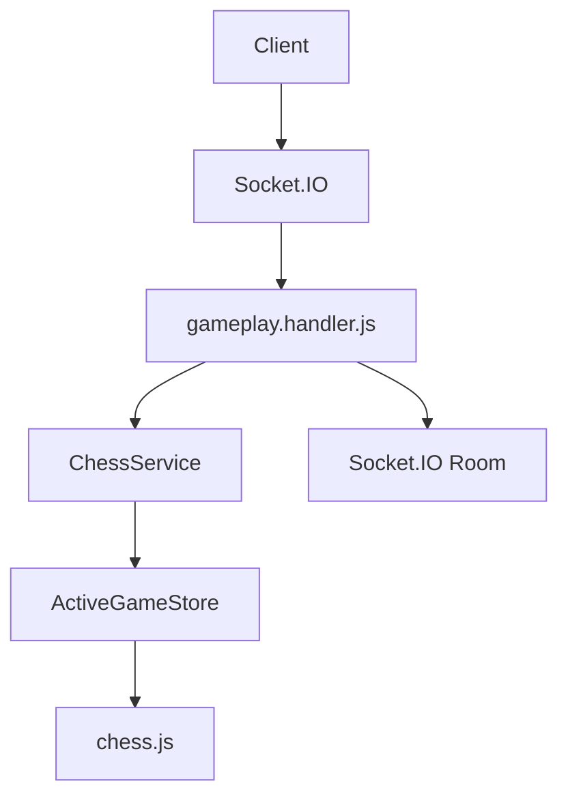

# Multiplayer Gameplay

This milestone connects Socket.IO to the authoritative chess engine. Clients never submit trusted board state; they only request actions, and `ChessService` validates or rejects those actions.

## Architecture



Socket handlers do not contain chess rules. They normalize payloads, call `ChessService`, and broadcast service results.

## Socket Flow

1. Player emits `create_game`.
2. Server creates an active game and a matching Socket.IO room.
3. Second player emits `join_game`.
4. Server joins the player to the active game and room, then broadcasts `game_started`.
5. Players emit `make_move`.
6. Server validates moves through `ChessService`.
7. Server broadcasts `board_updated` and any status event such as `check`, `checkmate`, `draw`, or `game_over`.

## Move Lifecycle

1. Client sends `make_move` with `gameId`, `playerId`, and `move`.
2. `gameplay.handler.js` forwards the request to `ChessService`.
3. `ChessService` checks game existence, player membership, turn ownership, terminal status, and move legality.
4. `ActiveGameStore` keeps the updated `Chess` instance, FEN, PGN, history, turn, and status.
5. Socket.IO broadcasts the updated board state to both players in the room.

## Synchronization

Every accepted move broadcasts:

- board
- FEN
- PGN
- move history
- game status
- current turn
- players

The server never accepts client-supplied board state.

## Reconnect Strategy

Disconnects mark the player as disconnected but keep the game alive. A reconnecting client emits `request_game_state` with `gameId` and `playerId`. The server marks the player connected again, rejoins the socket to the room, and returns the current authoritative state.

This is still in-memory. Redis is intentionally deferred.

The room reconnect step and the ChessService reconnect step are both required:
the room restores Socket.IO delivery, while ChessService restores the player
presence flags returned in `game_state`.

## Draw Workflow

A game can have only one pending draw offer. The recipient must explicitly
accept or decline it, and the pending offer is cleared after any accepted move,
accepted draw, declined draw, resignation, or terminal game result.

## Error Handling

Socket responses always use:

```json
{
  "success": false,
  "error": {
    "code": "ILLEGAL_MOVE",
    "message": "Move is not legal in the current position"
  }
}
```

Rejected moves emit `move_rejected`. Other failures emit `error`.

## Completion Events

Game completion broadcasts:

- `checkmate`
- `draw`
- `player_resigned`
- `game_over`

`game_over` includes winner, loser, draw flag, final PGN, final FEN, final status, and the full game state.
