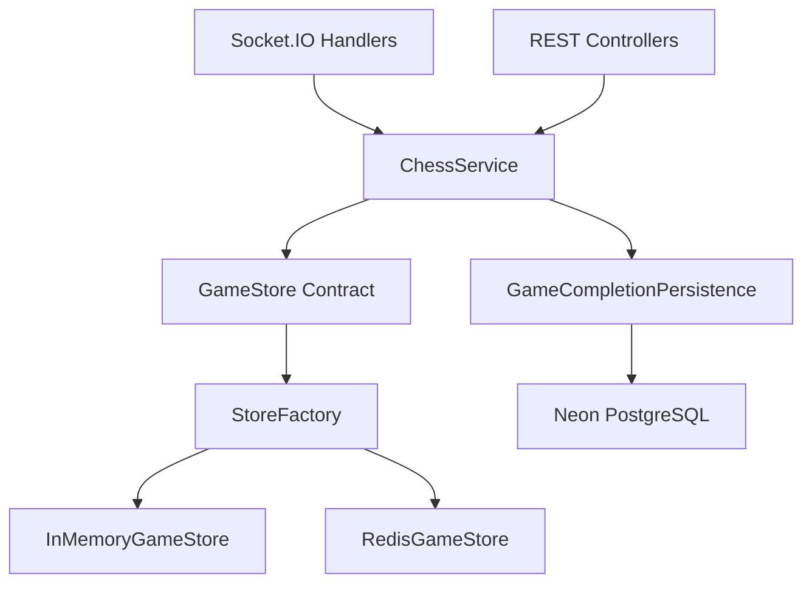

# Redis Active Game Storage

Milestone 6 replaces direct in-memory game storage with a GameStore abstraction.
`ChessService` remains the authoritative chess boundary, while stores persist
and restore active game state.

## Architecture



## Storage Abstraction

`GameStore` defines the active-game persistence contract:

- `createGame`
- `getGame`
- `updateGame`
- `deleteGame`
- `hasGame`
- `listGames`
- `save`
- `clear`

Stores do not validate moves, decide turns, calculate winners, or synchronize
Socket.IO rooms. That work stays in `ChessService`, `ChessValidator`, and socket
handlers.

## Redis Key Strategy

Active games use one key per game:

```text
game:{gameId}
```

Only active games are stored in Redis. Completed games are archived to
PostgreSQL and removed from Redis.

## Serialization Format

Redis stores JSON snapshots containing:

- game ID
- white and black players
- FEN
- PGN
- move history
- current turn
- game status
- draw offer state
- reconnect metadata
- created, updated, and completed timestamps

On read, the snapshot is rehydrated into an `ActiveGame` object with a fresh
`chess.js` instance. Move history is replayed first so PGN and future moves keep
the same behavior as the previous in-memory store.

Snapshots are validated during rehydration. Missing game IDs, missing white
players, invalid JSON, invalid FEN, or mismatched move history are converted into
structured store errors instead of crashing the server.

## TTL Strategy

`RedisGameStore` applies `ACTIVE_GAME_TTL_SECONDS` on every save. The default is
one hour.

Every successful move, join, draw action, reconnect, or disconnect refreshes the
TTL because the active game was touched. This keeps abandoned games from living
forever while allowing active games to continue normally.

## Reconnect Flow

1. Client emits `request_game_state` with `gameId` and `playerId`.
2. Socket handler asks `ChessService` for the active game.
3. `ChessService` loads it through the selected `GameStore`.
4. RoomManager restores missing room membership from persisted players when the
   process has restarted.
5. RoomManager reattaches the socket to the room.
6. `ChessService` marks the player connected and refreshes the active-game TTL.
7. Server returns FEN, PGN, move history, turn, status, players, and room state.

## Cleanup Strategy

When a game reaches a terminal state, `ChessService`:

1. saves the final active-game state,
2. persists the completed game to PostgreSQL inside a transaction,
3. creates an empty placeholder analysis row,
4. deletes the active Redis key.

If PostgreSQL persistence fails, the active game remains in the active store and
the server returns a structured `GAME_PERSISTENCE_FAILED` error instead of
crashing. If PostgreSQL persistence succeeds but Redis cleanup fails, the failure
is logged and the completed game response is still returned; the active key will
expire through its TTL.

## PostgreSQL Persistence Flow

Completed games persist:

- players
- game metadata and result
- winner when applicable
- PGN
- started and ended timestamps
- move history with SAN and FEN
- placeholder analysis row

Stockfish and AI analysis are intentionally deferred.
