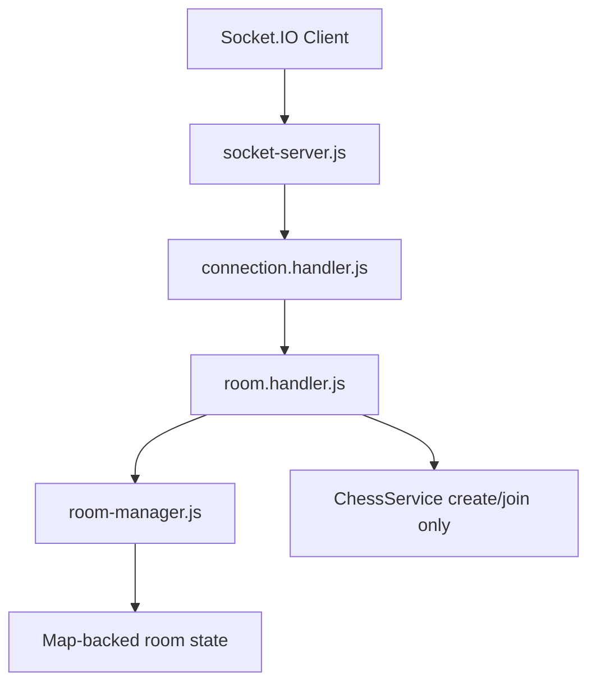

# Socket Architecture

This milestone adds Socket.IO infrastructure for networking and room management only. Chess move synchronization is intentionally deferred.

## Architecture Diagram

## Socket Lifecycle

1. Express creates the HTTP server.
2. `socket-server.js` attaches Socket.IO to that server.
3. `connection.handler.js` logs connection metadata and registers room events.
4. Room events use `room.handler.js`.
5. Disconnect events remove the socket from every tracked room.

Connection state recovery is enabled at the Socket.IO server level. This milestone logs recovered connections, but it does not replay or synchronize chess moves. If the transport is not recovered by Socket.IO, clients should create or join a room again; durable reconnect state belongs with the future Redis-backed room store.

## Room Lifecycle

1. Client emits `create_room`.
2. Handler asks `ChessService` to create a game and asks `RoomManager` to create a matching room.
3. Creator joins the Socket.IO room and receives `room_created`.
4. Second player emits `join_room`.
5. Handler checks room capacity, asks `ChessService` to join the game, and asks `RoomManager` to track the socket.
6. Room reaches `READY`.
7. The system waits for the next milestone to synchronize moves.

## Event Reference

Incoming:

- `connection`
- `create_room`
- `join_room`
- `leave_room`
- `disconnect`

Outgoing:

- `room_created`
- `room_joined`
- `room_left`
- `room_deleted`
- `room_full`
- `room_not_found`
- `player_joined`
- `player_left`
- `error`

All event names are defined in `backend/src/socket/constants/socket-events.constants.js`.

## Handler Responsibilities

- `socket-server.js`: initialize Socket.IO, configure CORS, and attach connection handlers.
- `connection.handler.js`: log connection/disconnect lifecycle and remove disconnected sockets from rooms.
- `room.handler.js`: translate socket events into room operations and consistent socket payloads.
- `room-manager.js`: track rooms, sockets, players, spectators, capacity, duplicate joins, and room deletion.
- `socket-events.js`: create consistent `{ success, data }` and `{ success, error }` payloads.

## Future Multiplayer Flow

The next milestone can add move synchronization by listening for a move event, delegating validation to `ChessService`, and broadcasting the updated board to the room. That work should not be added to RoomManager because RoomManager owns membership, not chess rules.

## Future Redis Scaling Strategy

`RoomManager` is deliberately isolated from ChessService. A Redis-backed room manager can later implement the same responsibilities while storing room membership outside the Node.js process. Socket handlers should keep calling the room-manager boundary instead of reaching into a `Map` directly.
