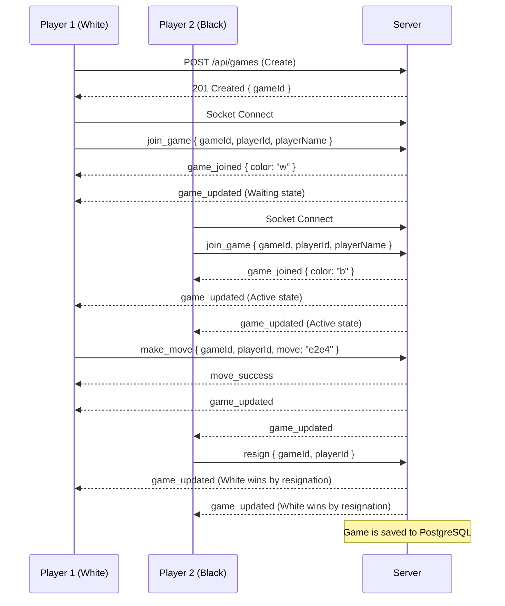

# Socket.IO Events

This document outlines the real-time WebSocket event architecture used during active multiplayer gameplay.

Connections are established at the root URL (e.g., `ws://localhost:4000`).

---

## 1. Multiplayer Lifecycle (Sequence Diagram)



---

## 2. Client → Server Events

These events are emitted by the frontend React application to the Node.js backend.

### `join_game`

- **Direction:** Client → Server
- **Payload:**
  ```json
  {
    "gameId": "uuid-v4",
    "playerId": "uuid-v4",
    "playerName": "Alice"
  }
  ```
- **Validation:** Ensures the game exists in Redis/Memory and has an open slot.
- **Success Response:** Emits `game_joined` back to the sender, and broadcasts `game_updated` to the room.
- **Error Response:** Emits `game_error` to the sender (e.g., "Game is full").

### `make_move`

- **Direction:** Client → Server
- **Payload:**
  ```json
  {
    "gameId": "uuid-v4",
    "playerId": "uuid-v4",
    "move": {
      "from": "e2",
      "to": "e4",
      "promotion": "q"
    }
  }
  ```
- **Validation:**
  1. Verifies the `playerId` owns the color currently to move.
  2. Uses `chess.js` to validate the move against the server-side board state.
- **Success Response:** Emits `move_success` to the sender, and broadcasts `game_updated` to the room.
- **Error Response:** Emits `game_error` to the sender (e.g., "Invalid move", "Not your turn").

### `resign`

- **Direction:** Client → Server
- **Payload:**
  ```json
  {
    "gameId": "uuid-v4",
    "playerId": "uuid-v4"
  }
  ```
- **Validation:** Verifies the `playerId` is an active participant in the game.
- **Success Response:** Broadcasts `game_updated` with the final completed state.

---

## 3. Server → Client Events

These events are emitted by the Node.js backend to connected frontend clients.

### `game_updated`

- **Direction:** Server → Client (Broadcast to Room)
- **Payload:**
  ```json
  {
    "id": "uuid-v4",
    "fen": "rnbqkbnr/pppppppp/8/8/8/8/PPPPPPPP/RNBQKBNR w KQkq - 0 1",
    "status": "active",
    "turn": "w",
    "players": {
      "w": { "id": "...", "name": "Alice" },
      "b": { "id": "...", "name": "Bob" }
    }
  }
  ```
- **Trigger:** Fired whenever the game state changes (player joins, move is made, game ends).

### `game_joined`

- **Direction:** Server → Client (Unicast to Sender)
- **Payload:**
  ```json
  {
    "color": "w",
    "gameId": "uuid-v4"
  }
  ```
- **Trigger:** Fired successfully completing a `join_game` request. Tells the client which side of the board they are playing.

### `move_success`

- **Direction:** Server → Client (Unicast to Sender)
- **Payload:** None
- **Trigger:** Fired after successfully validating a `make_move` request. Used by the client to resolve optimistic UI updates.

### `game_error`

- **Direction:** Server → Client (Unicast to Sender)
- **Payload:**
  ```json
  {
    "message": "Invalid move"
  }
  ```
- **Trigger:** Fired when any client-to-server request fails validation.
